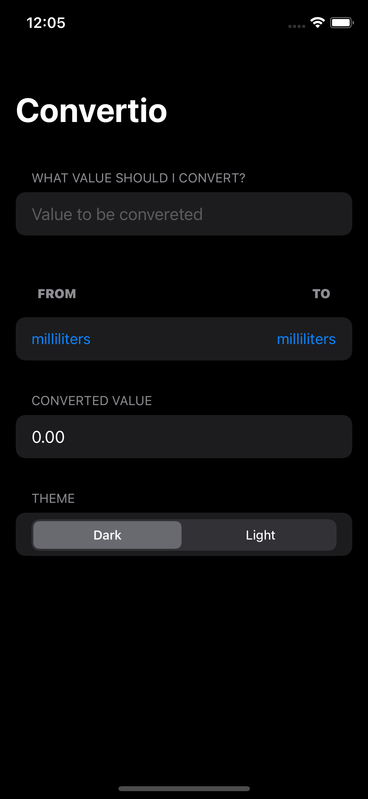
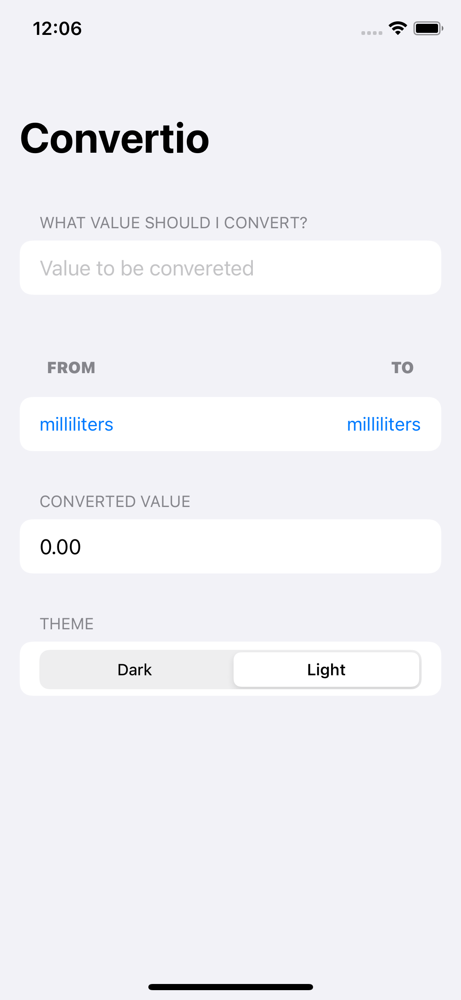
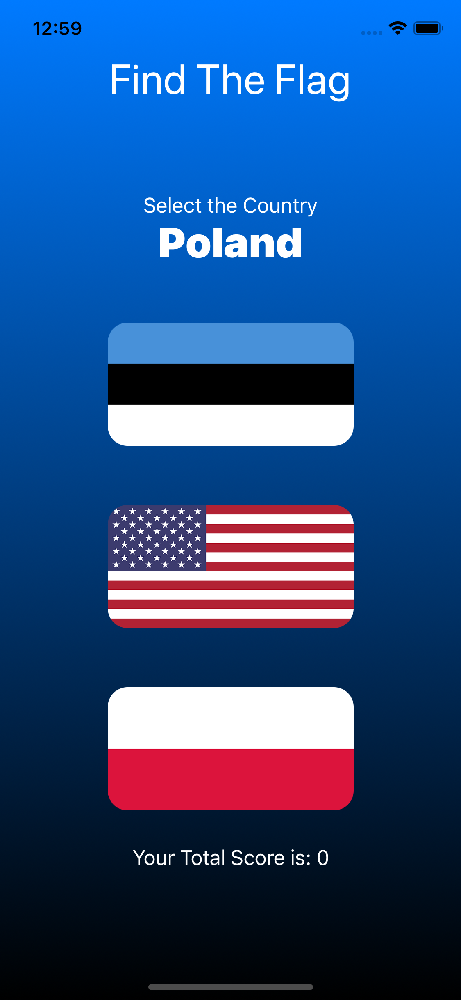
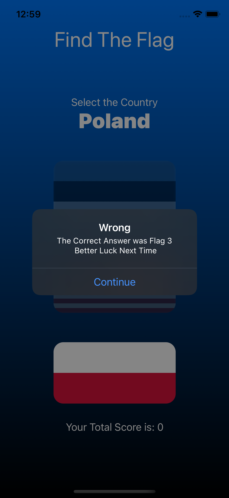
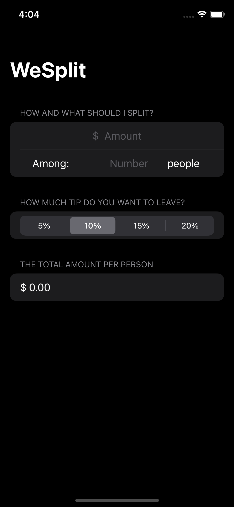
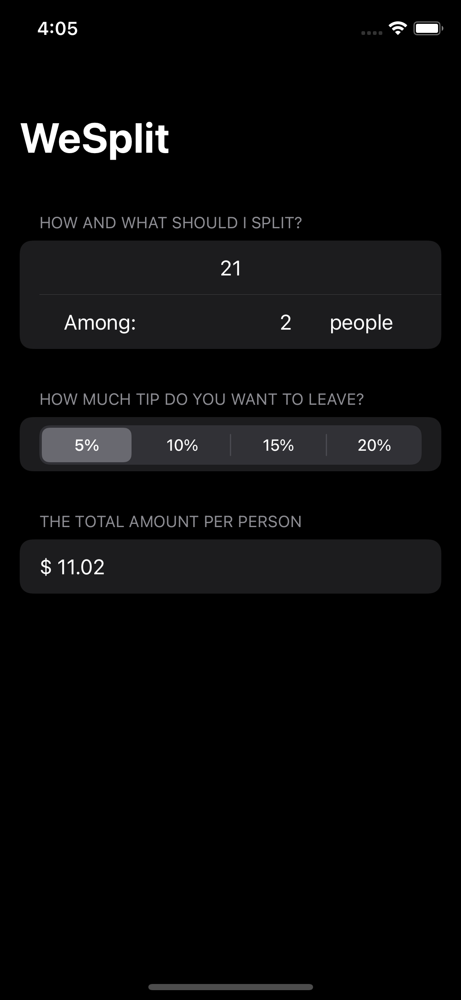

# SwiftUIPractice
This repository is a collection of SwiftUI Projects I built as part of the 100 days of SwiftUI course from HackingWithSwift
You can find the course [here](https://www.hackingwithswift.com/100/swiftui)

### Convertio

An app for interconversion between units. I added a fresh new dark theme to it

| Screen 1             |  Screen 2 |
:-------------------------:|:-------------------------:|
 | |

Preview

 https://user-images.githubusercontent.com/31688051/135743707-34892c76-36fa-4810-83ad-79fda750f3a6.mp4

### Find the Flag

Choose the correct flag and get rewarded type of game, uses animations and transformations to enhance the user experience

| Screen 1             |  Screen 2 |
:-------------------------:|:-------------------------:|
 | |

Preview

https://user-images.githubusercontent.com/31688051/135744481-97b703bc-e7bb-4dab-b345-e854682e903b.mov

### WeSplit

An app that can be used to calculate the split amount for a number of people, useful when paying bills etc with the tip included ofcourse

| Screen 1             |  Screen 2 |
:-------------------------:|:-------------------------:|
 | |

